# Kaggle Wyzwanie - Titanic

##  Wstęp

Witam wszystkich chętnych którzy chcieli by spróbować wyzwania Kaggle - Titanic. Jest to pierwsze zadanie z którym stykają się wszyscy na Kaggle zaraz po rejestracji.

Wyzwanie jest zaplanowane na 2 tygodnie od poniedziałku (09-07-2018) do następnego poniedziałku (23-07-2018). Jeśli termin już minął ta stroną będzie cały czas na Github tak żeby mieć możliwość przystąpić później.

Będzie on zarówno w R jak i Python tak żeby każdy nie był pokrzywdzony. Jest on podstawowy, dlatego można pytać o wszystko (od instalacji pythona, co to jest pip, po statystykę, itp..).

Planuje żeby w ciągu tygodnia robić 3 omówienia (w poniedziałek, środę i piątek) rozłożone na dwa tygodnie tak żeby każdy mógł mieć czas na przemyślenia, napisanie kodu i jeszcze pytania.

1. (poniedziałek) Opis problemu, Importowanie danych i podstawowe informacje
2. (środa) Wykresy i wyszukiwanie danych
3. (piątek) Wypełnianie pustych danych i normalizacja Danych
4. (poniedziałek) Klasyfikacja - algorytm
5. (środa) Poprawianie Modelu
6. (piątek) Podsumowanie

Podczas każdego omówienia postaram się opisać (github) co się dzieje i podać rozwiązanie dla każdego języka. W razie jakilkowiek pytań będzie można zadawać na slacku. Prosze mieć na uwadzę że też się uczę części rzeczy (zwłaszcza R), tak więc jak będzie jakiś błąd, niezrozumienie z mojej strony albo uwagi, proszę mnie o tym poinformować a ja to postaram się poprawić :)

Wyzwanie można śledzić na grupie: https://www.facebook.com/groups/1733307126704677/

Osoby chętne, proszę dołączyć do slacka:  https://kagglepolska.slack.com  (link na grupie)
A pytania można zadawać na grupie pod #titanic

Przed warto sobie zainstalować środowiska. Do pythona polecam Anaconda które zawiera Pythona oraz edytor Spyder:

[https://www.anaconda.com/download/](https://l.facebook.com/l.php?u=https%3A%2F%2Fwww.anaconda.com%2Fdownload%2F&h=AT3KBJmnbNForgOyaBAthdtEwHokEBcN5wxhecOaP6KHrogmjIahWy5QBvC4EQrI4zT_Hn-gux-DYbjT5GdcrRikdd1G-dSwlIoSoD2moZzk9goafB4NGDL3m9YJjespZhktWV1t-Xv--ij3KT0cpm62)

Do R 
Edytor: Rstudio <https://www.rstudio.com/products/rstudio/download/>
oraz interpretator: Microsoft R Open
[https://mran.microsoft.com/open](https://l.facebook.com/l.php?u=https%3A%2F%2Fmran.microsoft.com%2Fopen&h=AT2yK6gYzYee0aJb_MNB13kBtZsBowTu2_O0sXZuGF7sn0rUwGD2hBEe1-MZkXgCYwsdh1m3HxZ3BzYtVHgzQoQO_Ba6-MwwfnZhMLOkYFf4W9y5Nu4g2nqeId-jk6QmwA3X_DKB5zOJyhCVFM03quuV)

Link do Titanic na kaggle:
[https://www.kaggle.com/c/titanic](https://l.facebook.com/l.php?u=https%3A%2F%2Fwww.kaggle.com%2Fc%2Ftitanic&h=AT2raqxH5o2kx34UcBIb47BhFisW4MaJQlXqEfze91zsu8UjNqyx5wOVzLWE7PJTjF2pMD6XwaQ3IegwUZ72RHuMPDNy57d-aRDREXwfMl3ULS4hOsCTT6FO2bqTEzyptCDQd_tU_iWk_kK2T48rt7C4)

Zaczynamy od poniedziałku, i życzę powodzenia :)

## Titanic, Wstęp


Jak można wyczytać, głównym zamiarem jest sklasyfikowanie pasażerów pod względem przeżycia podczas zatonięcia Tytanika które to miało miejsce w 15 kwietnia 1912. Jest to przykład binarnej klasyfikacji w której na podstawie danych wejściowych  (takich jak klasa, numer biletu, płeć itp..) mamy wywnioskować czy osoba ta przeżyła wypadek.

Nie licząc żę był to zwykły łut szczescia można wyobrażić sobie kilka czynników które rzeczywiście miały na to wpływ.
Do nich można zaliczyć:

* Jak blisko ich kajuty były łodzi ratunkowych
* W jakim wieku byli, np: młodsze osoby albo kobiety z dziećmi miały większe prawdopobieństwo dostania się do kajuty.
* Osoby mające droższe bilety a więc wyżej sytuowane mogli mieć jakieś przywileje

I tutaj to badanie ma za zadanie wyliczyć to powiązanie.
Na początku warto zobaczyć sobie dane wejściowe. Na wstępie mamy takie oto kolumny:

| Variable           |                                                              |
| ------------------ | ------------------------------------------------------------ |
| Zmienna (Variable) | Opis                                                         |
| Survived           | Czy dana osoba przeżyła. 0 - Nie, 1 - Tak. Ta wartość pojawia się tylko w test |
| PClass             | Klasa socio-economic (SEC), 1- Upper, 2 - Middle, 3rd - Lower |
| Name               | Imi i nazwisko oddzielone przecinkiem                        |
| Sex                | Płeć, ‘male’ - męzczyzna , ‘female’- kobieta                 |
| Age                | wiek                                                         |
| SibSp              | (siblink) liczba rodzeństwa (brat i siostra) / (spouses) małżonków na pokładzie |
| parchl             | iczba rodziców / dziecie na pokładzie                        |
| fare               | opłata za bilet                                              |
| cabin              | numer kabiny                                                 |
| embarked           | Port źródłowy /załadunkowy (C - Cherbourk, Q - Quenstown, S - Southampton) |

Pełny wygląd klas można zobaczyć na stronie:
[https://www.encyclopedia-titanica.org/class-gender-titanic-disaster-1912~chapter-2.html](https://www.encyclopedia-titanica.org/class-gender-titanic-disaster-1912~chapter-2.html)

Przeglądając pobieżnie można zobaczyć że nie wszystkie dane są wypełnione, więc trzeba je  w pewnym momencie wypełnić.

##  Podstawowe operacje

Zaczynając prace z Kaggle mamy tak naprawdę 3 możliwości:

1. Możemy ściągnąć dane train i test i działać na nim lokalnie
2. Możemy utworzyć Kernel i wysłać skrypt który rozwiąże zadanie
3. Możemy utworzyć Kernel i za pomocą edytora “Jupyter Notebooks”nie tylko wykonać wszystkie operacje ale także dodać w wygodnym edytorze MarkDown własne przypisy czy wykresy.

Ja wybrałem Markdown bo można na bieżąco kontrolować co się dzieje.
Jeśli chcesz utworzyć nowy kernel na stronie [https://www.kaggle.com/c/titanic](https://www.kaggle.com/c/titanic) wybieramy Kernels -> New Kernel -> Notebook u góry po prawej możemy zmienić język z Python (który jest domyślny) na R.

## Podstawowe operacje: Python

Do podstawowych operacji pandas dobrze popatrzeć na cheatsheet:

[http://pandas.pydata.org/Pandas_Cheat_Sheet.pdf](http://pandas.pydata.org/Pandas_Cheat_Sheet.pdf)

Krótkie porównanie znalezione na facebook-u.

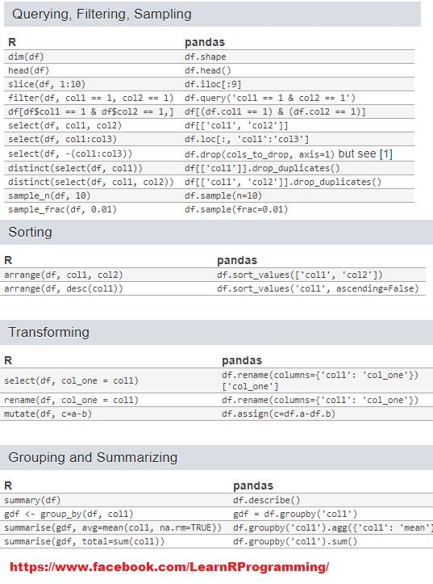 

###  Biblioteki

Pierwsze co pozostaje to zaimportowanie najważniejszych bibliotek które przydadzą się do operacji na danych.

```R
import numpy as np # linear algebra
import pandas as pd # data processing, CSV file I/O (e.g. pd.read_csv)

from subprocess import check_output
print(check_output(["ls", "../input"]).decode("utf8"))
```

- numpy - podstawowy biblioteka do algebry liniowej
- pandas - biblioteka dzięki której można używać powszechne struktury data.frame bardzo pomocne przy obliczeniach

### pd.read_csv(name,header, index_col)

Do importu danych służy polecenia pd.read_csv() z biblioteki pandas. Bibliotek ta zwraca nam automatycznie obiekt DataFrame. Ten obiekt po pierwsze jest wygodniejszy do obliczeń typowych danych które są w formie dwuwymiarowej (wiersze i kolumny) a po drugie szybszy.

* header - 0 wskazuje że zerowy wiersze będzie nam wskazywał nazwy kolumn
* index_col - Wskazuje gdzie się znajduje kolumna z id (tutaj PassengerID)

```python
# Load the data, we set that index_col is the first column, therefore there will be standard index start from 0 for each data.
train_df = pd.read_csv('../input/train.csv', header=0,index_col=0)
test_df = pd.read_csv('../input/test.csv', header=0,index_col=0)
```

### pd.concat(a,b)

To polecenie na początku łączy nam oba obiekty po wierszach. Analizę danych powinniśmy robić na całym obszarze, bo może się zdarzyć że np: w train kolumna ma wszystkie pola wypełnione ale w tests już nie.

```Python
full = pd.concat([train_df , test_df]) # concatenate two dataframes
```

### df.info()

Pokazuje podstawowe informacje obiektu, pozwala się rozejrzeć co za dane są w posczególnych kolumnach.

```Python
full.info()   # info about dataframe
```

```Python
<class 'pandas.core.frame.DataFrame'>
Int64Index: 1309 entries, 1 to 1309
Data columns (total 11 columns):
Age         1046 non-null float64
Cabin       295 non-null object
Embarked    1307 non-null object
Fare        1308 non-null float64
Name        1309 non-null object
Parch       1309 non-null int64
Pclass      1309 non-null int64
Sex         1309 non-null object
SibSp       1309 non-null int64
Survived    891 non-null float64
Ticket      1309 non-null object
dtypes: float64(3), int64(3), object(5)
memory usage: 122.7+ KB
```

* Ponieważ 1309 to jest łączna liczba wierszy, to tam gdzie znajduje się ich mniej (poza Survived które nie występuje w test_df) znajdują się wartości które nie są wypełniona. 

### df.head()

Pokazuje pierwsze wiersze danych i można się spostrzec że Cabin, Embarked, Name, Sex oraz Ticket które .info() są jako object tak naprawdę to tekst. 

```Python
full.head()
```


### Wybieranie kolumn

```R
# import matplotlib.pyplot as plt
    
full[["Age","Pclass"]][5:30]
```


### Filtrowanie

Przykłady wybierania wierszy:

* Jak w pythonie do każdej listy można wybierać przez indeks

```R
full[:10] # Pierwszych 10 elementów
```


* 5 ostatnich elementów 

```Python
full[-5:] 
```


* Konkretnie od konkretnego wiersza idąc co 2, 891 - to pierwszy wiersz z bazy test_df

```Python
SURV = 891
full[SURV:SURV+10:2] # Like in regular Python you can get to the Item by Index
```

* filtrowanie po kolumnie

```R
full[(full['Age'] > 5.0) & (full['Age'] < 7.0 ) ] #filter data by columns
```


* Filtrowanie po tekście

```python
full[(full['Cabin'].str.contains('B2',na=False)) ] #filter data by columns
```

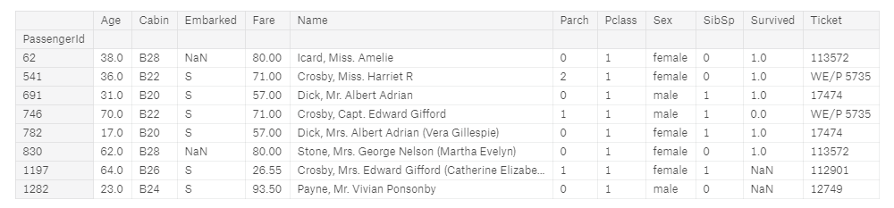

* filtrowanie po pustych wartościach

```Python
 full[full['Embarked'].isnull()]
```


### df.isnull()

Najważniejsze jest znalezielenie pustych wierszy. .isnull() zwraca nam cały zbiór z wartościami False,True czy jest pusta, .sum grupuje je dla wszystkich kolumn.

```Python
full.isnull().sum()  # Check with alues are empty
```

```R
Age             263
Cabin          1014
Embarked          2
Fare              1
Name              0
Parch             0
Pclass            0
Sex               0
SibSp             0
Survived        418
Ticket            0
CabinType         0
_CabinType        0
CabinType2        0
_CabinType2       0
dtype: int64

```

* Wartości Age,Cabin, Embarked, Fare, trzeba będzie uzupełnić danymi przed dalszym przetwarzaniem
* Istnieje także wykres który pokazuje puste wartości

```R
#Missing values in the plot
import missingno as msno
msno.matrix(full)
```


### groupby()

Dane też można grupować by zobaczyć jak wyglądają zmienne na poszczególne grupy (np: sumujemy sobie ilość osób które przeżyły w podziale na klasy i płeć)

```R
train_df.groupby(['Pclass','Sex'])['Survived'].sum() # grouping data
```

```R
Pclass  Sex   
1       female    91
        male      45
2       female    70
        male      17
3       female    72
        male      47
Name: Survived, dtype: int64
```

##  Podstawowe operacje: R

Podstawowe funkcje można znaleść w:

[https://www.rstudio.com/wp-content/uploads/2016/10/r-cheat-sheet-3.pdf](https://www.rstudio.com/wp-content/uploads/2016/10/r-cheat-sheet-3.pdf)

[https://s3.amazonaws.com/assets.datacamp.com/blog_assets/Tidyverse+Cheat+Sheet.pdf](https://s3.amazonaws.com/assets.datacamp.com/blog_assets/Tidyverse+Cheat+Sheet.pdf)

[https://www.rstudio.com/wp-content/uploads/2015/02/data-wrangling-cheatsheet.pdf](https://www.rstudio.com/wp-content/uploads/2015/02/data-wrangling-cheatsheet.pdf)

### Biblioteki

Najpierw importujemy biblioteki

```R
library(tidyverse) # metapackage with lots of helpful functions
list.files(path = "../input")
```

* tidyverse - kolekcja paczek do data-science, zawiera w sobie już wiele potrzebnych paczek

W R podobnie jak w python podstawowym obiektem na którym operujemy jest data.frame (w książce Biecka “Przewodnik po pakiecie R” nazywane także  jako“ramki danych”) który jest 2 wymiarową tablicą z kolumnami i wierszami. W przypadku większych danych jest jeszcze struktura data.table ale dla 1309 tysiąca wierszy wystarczy zwykły data.frame. 

### read_csv()

```R
train <- read_csv('../input/train.csv')
test  <- read_csv('../input/test.csv')
```

import danych, funkcja już wie że pierwszy wiersz opisuje kolumny, nie trzeba to zaznaczać w metodzie.

### rbind()

Połączenie wierszy danych, tak żeby móc zobaczyć pełną informację o danych. Nie można łączyć danych o różnych ilościach kolumn dlatego do kolumny test$Survived dodajemy pustą informację.

```R
test$Survived <- NA
full <- rbind(train, test)
```

### str()

Podaje podstawe informacje o danych, jak typ - przykłady wartości.

```R
str(full)
```

```R
Classes ‘tbl_df’, ‘tbl’ and 'data.frame':	1309 obs. of  12 variables:
 $ PassengerId: num  1 2 3 4 5 6 7 8 9 10 ...
 $ Survived   : num  0 1 1 1 0 0 0 0 1 1 ...
 $ Pclass     : num  3 1 3 1 3 3 1 3 3 2 ...
 $ Name       : chr  "Braund, Mr. Owen Harris" "Cumings, Mrs. John Bradley (Florence Briggs Thayer)" "Heikkinen, Miss. Laina" "Futrelle, Mrs. Jacques Heath (Lily May Peel)" ...
 $ Sex        : chr  "male" "female" "female" "female" ...
 $ Age        : num  22 38 26 35 35 NA 54 2 27 14 ...
 $ SibSp      : num  1 1 0 1 0 0 0 3 0 1 ...
 $ Parch      : num  0 0 0 0 0 0 0 1 2 0 ...
 $ Ticket     : chr  "A/5 21171" "PC 17599" "STON/O2. 3101282" "113803" ...
 $ Fare       : num  7.25 71.28 7.92 53.1 8.05 ...
 $ Cabin      : chr  NA "C85" NA "C123" ...
 $ Embarked   : chr  "S" "C" "S" "S" ...
 - attr(*, "spec")=
  .. cols(
  ..   PassengerId = col_double(),
  ..   Survived = col_double(),
  ..   Pclass = col_double(),
  ..   Name = col_character(),
  ..   Sex = col_character(),
  ..   Age = col_double(),
  ..   SibSp = col_double(),
  ..   Parch = col_double(),
  ..   Ticket = col_character(),
  ..   Fare = col_double(),
  ..   Cabin = col_character(),
  ..   Embarked = col_character()
  .. )
```

### dim()

Zwraca rozmiar data.frame (wiersze i kolumny )

```R
dim(full)
nrow(full) #liczba kolumn
ncol(full) #liczba wierszy
```

```R
1309 12
```

### head()

Zwraca kilka pierwszych wierszy do rozeznania się.

```R
head(full)
```


### summary()

```R
summary(full)
```

Zwraca podstawowe informacje o kolumnach - jak liczba pustych wartości, wartość minimalna, maksymalna, mediana itp… Już widać że kilka kolumn ma puste wartości które to trzeba będzie uzupełnić póżniej. (NA’s)

```R
 PassengerId      Survived          Pclass          Name          
 Min.   :   1   Min.   :0.0000   Min.   :1.000   Length:1309       
 1st Qu.: 328   1st Qu.:0.0000   1st Qu.:2.000   Class :character  
 Median : 655   Median :0.0000   Median :3.000   Mode  :character  
 Mean   : 655   Mean   :0.3838   Mean   :2.295                     
 3rd Qu.: 982   3rd Qu.:1.0000   3rd Qu.:3.000                     
 Max.   :1309   Max.   :1.0000   Max.   :3.000                     
                NAs   :418                                        
     Sex                 Age            SibSp            Parch      
 Length:1309        Min.   : 0.17   Min.   :0.0000   Min.   :0.000  
 Class :character   1st Qu.:21.00   1st Qu.:0.0000   1st Qu.:0.000  
 Mode  :character   Median :28.00   Median :0.0000   Median :0.000  
                    Mean   :29.88   Mean   :0.4989   Mean   :0.385  
                    3rd Qu.:39.00   3rd Qu.:1.0000   3rd Qu.:0.000  
                    Max.   :80.00   Max.   :8.0000   Max.   :9.000  
                    NAs   :263

    Ticket               Fare            Cabin             Embarked        
 Length:1309        Min.   :  0.000   Length:1309        Length:1309       
 Class :character   1st Qu.:  7.896   Class :character   Class :character  
 Mode  :character   Median : 14.454   Mode  :character   Mode  :character  
                    Mean   : 33.295                                        
                    3rd Qu.: 31.275                                        
                    Max.   :512.329                                        
                    NAs   :1  
```

### Wybieranie kolumn

```R
full[,c("Survived","Pclass")]
```

* Lub przez select z dplyr

```r
library(dplyr)

select(full,Survived,Pclass)
```

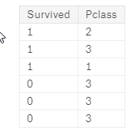

### Filtrowanie

* Dane można zaznaczać przez indeksy

```R
full[1:9,]
```


* Do bardziej zaawansowango filtrowania po wartościach używa się biblioteki dplyr. Można używać złączeń typu AND “&”OR “|” NOT “!”

```R
library(dplyr)

filter(full, Age > 5.0 & Age < 7.0 )
```

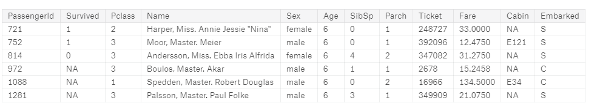

* Dodatkowo można to kaskadować na kolejne wyrażenia z dplyr. W tym wypadku nie trzeba za każdym razem zaznaczać danych (full)

```R
full %>% 
	filter(Age > 5.0 & Age < 7.0 ) %>%
	select(Survived,Pclass)
```

* sprawdzanie pustych wartości

```R
full %>% 
	filter( is.na(Fare) )
```

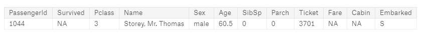

* Filtrowanie po tekście używająć stringr

https://cran.r-project.org/web/packages/stringr/vignettes/stringr.html

```R
library(stringr)

full %>%
    filter( str_detect(Cabin, 'B2') )
```

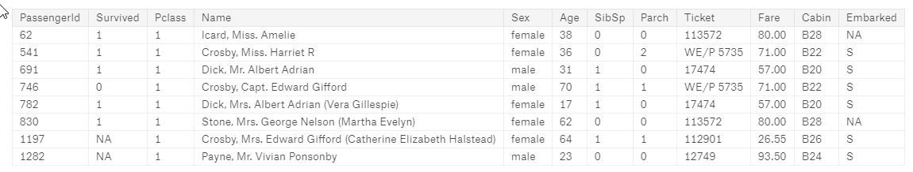

### Grupowanie

* Do sumowania i groupowania przydaje się dplyr, tutaj wymagane jest jeszcze usunięcie pustych wartości survived ponieważ w przeciwnym wypadku pojawi się N/A w wyniku.

```R
full %>%
	drop_na(Survived) %>%
    group_by(Pclass,Sex) %>%
	summarise(Survived = sum(Survived))
```

* Można też nie używać drop_na a opcji <Badge text="na.rm=T" type="error"/> 

```R
full %>%
    group_by(Pclass,Sex) %>%
	summarise(Survived = sum(Survived, na.rm = T))
```

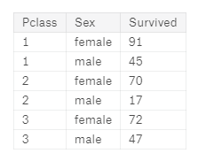

## Wykresy i wyszukiwanie danych

Tak naprawdę pod tym pojęciem chciałem napisać w jaki sposób można dodać kolumny zawierające dodatkowe informacje które kryją się w surowych danych ponieważ może się zdarzyć że:

* Jakieś informacje znajdują się w tekście a ponieważ znajdują się tam także inne informacje to algorytm nie wykryje że dana zmienna ma istotny wpływ
* Niektóre dane są zbyt rozdrobnione (np: wiek) przez co zaburzają obraz całego modelu. Przecięz podczas próby uratowania się nikt nie pytał dokładnie o wiek, więc można podzielić je na mniejsze grupy typu małe dzieci, dorośli itp..
* Część danych jest w postaci tekstowej, i trzeba je skategoryzować.

##  Dane: Python

### Kategoryzacja

* Pierwszym problemem  w danych są dane tekstowe którze trzeba skategoryzować. W tym wypadku można użyć pandas.Categorical()

```Python
full['_Sex'] = pd.Categorical(full.Sex).codes
full['_Embarked'] = pd.Categorical(full.Embarked).codes
```

W nowych kolumnach pojawią wartości 0  1

### Kategoryzacja kolumny Cabin

* Także tą kolumnę można skategoryzować. Można zauważyć że pierwsza litera może mieć jakieś znaczenie. Nie wszystkie dane są wypełnione, 

```Python
full['_CabinType'] = pd.Categorical(full['Cabin'].astype(str).str[0]).codes
```

### Korelacja

* Korelacja przydaje się do sprawdzenia zależności w kolumnach
  * Korelacja wynosząca 1.0 oznacza pełną dodanie powiązanie (Jest na przekątnych), 
  * Korelacja wynosząca -1.0 oznacza odwrotne powiązanie
  * Im bliższe 0 tym korelacja jest mniejsza

Z poniższego można wywnioskować że największy wpływ na przeżycie może mieć Pclass, \_Sex, Fare, oraz \_ CabinType. Musieliśmy wcześniej skategoryzować kolumnu ponieważ korelacji nie można sprawdzić na tekście.

```Python
cols = ['Age','_Embarked','Fare','Parch','Pclass','_Sex','SibSp','Survived','_CabinType']
full[cols].corr()
```

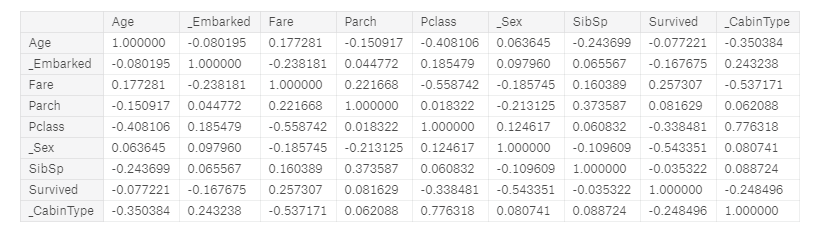

###  Tytuł - Pattern

* Warto sobie wyciągnąć tytuł z imienia i nazwiska czyli kolumny Name. Do tego przydaje się regular expression

```Python
pat = r",\s([^ .]+)\.?\s+"

full['Title'] =  full['Name'].str.extract(pat,expand=True)[0]
full.groupby('Title')['Title'].count()
```

```Python
Title
Capt          1
Col           4
Don           1
Dona          1
Dr            8
Jonkheer      1
Lady          1
Major         2
Master       61
Miss        260
Mlle          2
Mme           1
Mr          757
Mrs         197
Ms            2
Rev           8
Sir           1
the           1
Name: Title, dtype: int64
```

Najwięcej jest Miss, Master, Mr, oraz Mrs. Więc dla lepszego obrazu można zgrupować część danych.

```Python
full.loc[full['Title'].isin(['Mille','Ms','Lady']),'Title'] = 'Miss'
full.loc[full['Title'].isin(['Mme','Sir']),'Title'] = 'Mrs'
full.loc[~full['Title'].isin(['Miss','Master','Mr','Mrs']),'Title'] = 'Other' # NOT IN
full['_Title'] = pd.Categorical(full.Title).codes
full.groupby('Title')['Title'].count()
```

```Python
Title
Master     61
Miss      263
Mr        757
Mrs       199
Other      29
Name: Title, dtype: int64
```

- Od razu zmniejszyła się ilość kategorii


## Wykresy: Python

W pythonie do podstawowych wykresów głównie się używa matplotlib, seaborn oraz ggplot (bazujące na ggplot2 z R-a).

### Histogram

* Podstawowym wykresem jest histogram czyli rozłożenie wartości według częstości występowania.

```python
full['Age'].hist(); 
```

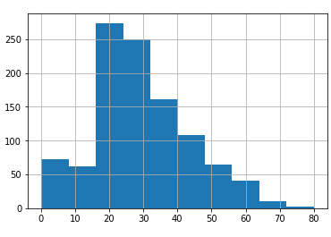

Od razu widać żę najwięcej jest osób w przedziale od 20 do 30 roku życia.

* Ale możemy chcieć też większy podział albo przefiltrowane na tylko te które przeżyły

```python
full[full['Survived']==1]['Age'].hist(bins=30)
```


* Można też nałożyć na siebie histogramy (za pomocą plt z matplotlib). Tworzymy dwa histogramy (plt_all i plt_survived), dodajemy legendę i wyświetlamy.

```Python
import matplotlib
import matplotlib.pyplot as plt

plt_all = plt.hist(full['Age'],bins = 30,  range = [0,100],label='all')
plt_survived =plt.hist(full[full['Survived']==1]['Age'], bins = 30, range = [0,100],label='Survived')

plt.legend()
plt.show()
```

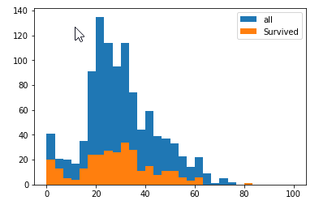

Zauważyć można żę młodsi mają większą szansę przeżycia (pomarańczowa pokrywa połowę wartości albo większość dla od 0 do 10)

###  Boxplot

Zawiera on dużo informacji więc lepiej doczytać co oznaczają poszczególne wartości

https://www.wellbeingatschool.org.nz/information-sheet/understanding-and-interpreting-box-plots

```Python
full.boxplot(column='Age')
```


```Python
full.boxplot(column='Age',by='Pclass')
```

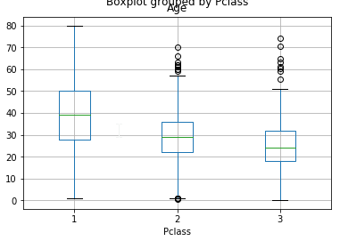

### Correlation map

* Dzięki correlation map możemy odczytać związki pomiędzy poszczególnymi kolumnami


###  Dendrogram

* Jednym z ciekawszych wykresów jest dendogram, który pokazuje zależności danych  w postaci drzewa

Ten wykres można potraktować jako ciekawostkę, jedyne co można odczytać to to że Cabin i Age są najbardziej wpływowymi kolumnami.

```python
import missingno as msno
msno.dendrogram(full)
```


### Heatmap

* Heatmap pozwala zobaczyć zależności z korelacji. Ujemne korelacje są na ciemniejsz, a dodanie na coraz jaśniejsze.

```Python
cols = ['Age','_Embarked','Fare','Parch','Pclass','_Sex','SibSp','Survived','_CabinType']
corr = full[cols].corr()

import seaborn as sns
sns.heatmap(corr)
```


### Wykresy zbiorowe

* Wykresy można grupować przez sublots() - podajemy ilość kolumn i wierszy. Np, ja mogę łatwo zobaczyć stosunek ilości przeżytych do całości.

```Python
for column in ['Pclass','Sex','SibSp','Parch','Embarked']: 
    fig, axes = plt.subplots(nrows=1, ncols=2)

    (train_df
        .groupby(column)['Survived']
        .agg(['count','sum'])
        ).plot.bar(ax=axes[0])
    (train_df
        .groupby(column)['Survived']
        .mean()
        ).plot.bar(ax=axes[1])
```


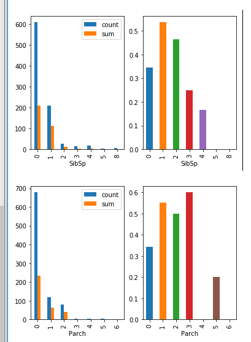

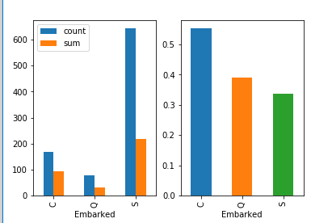

* Wyciągnałem tak też nową kolumnę TicketCounts które oznacza ile osób ma ten sam numer biletu.

```Python
full['TicketCounts'] = full.groupby(['Ticket'])['Ticket'].transform('count')

(full
.groupby('TicketCounts')['Survived']
.agg(['count','sum'])
).plot.bar()
plt.show()
(full
.groupby('TicketCounts')['Survived']
.mean()
).plot.bar()
plt.show()
```

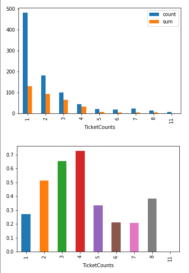


## Dane: R

### Kategoryzacja

* W przypadku R kategoryzacja polega na przerobieniu na factor za pomocą as.factor a następnie na as.numeric

```R
full$Sex2 <- as.numeric(as.factor(full$Sex))
full['_Embarked'] = pd.Categorical(full.Embarked).codes

```

### Kategoryzacja kolumny Cabin

```R
full$Cabin2 <-as.numeric(as.factor(substring(full$Cabin, 0, 1) ))
```

### Korelacja

* Korelacje można wwykonać przez funkcję 

```R
cols <- c('Age','Sex2','Embarked2','Fare','Parch','Pclass','SibSp','Survived','Cabin2')
cor( full[,cols], use="complete.obs")
```

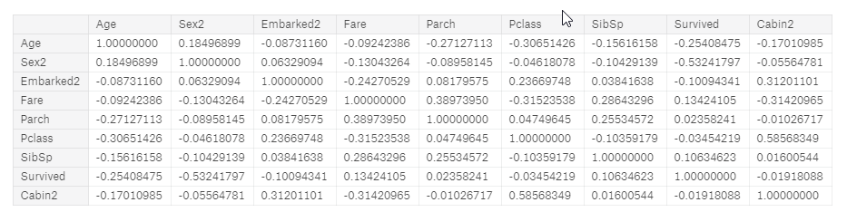

Widać największą korelację przy kolumnie Sex2, Age, Fare. To pomoże przy określaniu kolumn dostępnych do algorytmu.

### Tytuł - Pattern

* Warto sobie wyciągnąć tytuł z imienia i nazwiska czyli kolumny Name. Do tego przydaje się regular expression
* Tytuł można wyłuskać przez str_match z biblioteki 

```R
library(stringr)
full$Title <- str_match(full$Name, ",\\s([^ .]+)\\.?\\s+")[,2]
```

```R
full %>% 
  group_by(Title) %>% 
  summarise(cnt = n()) %>%
  arrange(desc(cnt))
```

```R
 Title      cnt
   <chr>    <int>
 1 Mr         757
 2 Miss       260
 3 Mrs        197
 4 Master      61
 5 Dr           8
 6 Rev          8
 7 Col          4
 8 Major        2
 9 Mlle         2
10 Ms           2
11 Capt         1
12 Don          1
13 Dona         1
14 Jonkheer     1
15 Lady         1
16 Mme          1
17 Sir          1
18 the          1
```

* Część danych nie jest potrzebna, dlatego najlepiej zgrupować je sobie w kilka kategori do lepszego predykcji

```R
full$Title2 <- full$Title
full$Title2[ full$Title %in% c('Mille','Ms','Lady')] <- 'Miss'
full$Title2[ full$Title %in% c('Mme','Sir')] <- 'Mrs'
full$Title2[ ! full$Title %in% c('Miss','Master','Mr','Mrs')] <- 'Other' 

full %>% 
  group_by(Title2) %>% 
  summarise(cnt = n()) %>%
  arrange(desc(cnt))
```

```R
 Title2   cnt
  <chr>  <int>
1 Mr       757
2 Miss     260
3 Mrs      197
4 Master    61
5 Other     34
```

## Wykresy: R

###  Histogram

```R
hist(full$Age)
```


```R
ggplot(data=full, aes(full$Age)) + geom_histogram()
```


```R
ggplot(data=full, aes(full$Age)) + geom_histogram(bins=10)
```


